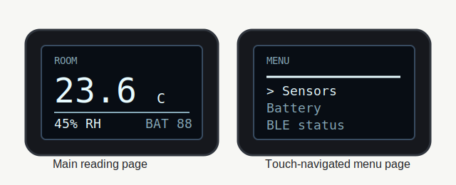

# LYWSD03MMC SSD1306 Touch UI Firmware

Experimental firmware build for the Xiaomi LYWSD03MMC temperature and humidity sensor after replacing the original segmented LCD with a 128x64 SSD1306 I2C OLED and adding a small touch sensor for page navigation.

This build is based on the ATC v58 firmware from [pvvx/ATC_MiThermometer](https://github.com/pvvx/ATC_MiThermometer), which is a fork of [atc1441/ATC_MiThermometer](https://github.com/atc1441/ATC_MiThermometer). It is not an official Xiaomi, pvvx, or atc1441 release.

  
  

## Features

- SSD1306 OLED output for a modified LYWSD03MMC with the original LCD removed.
- Page-based interface for temperature, humidity, battery, status, and a small test/menu view.
- Touch input on PA6/P8 for faster page/menu navigation.
- Two touch variants: normal active-high and active-low.
- Small OLED animation and modern compact UI layout.
- Keeps the ATC firmware base for BLE advertising, sensor reading, configuration, and OTA flashing behavior.

## Hardware

Required parts:

- Xiaomi LYWSD03MMC temperature and humidity sensor.
- 128x64 SSD1306 I2C OLED module, normally address `0x3C`.
- Small 3-pin capacitive touch module, such as a TTP223-style module.
- Thin wire, soldering tools, and a stable 3.3 V supply.

Known working wiring:

| Module | Module pin | LYWSD03MMC connection |
| --- | --- | --- |
| SSD1306 OLED | SDA | PB7 / P11 |
| SSD1306 OLED | SCL | PD7 / P7 |
| SSD1306 OLED | GND | GND |
| SSD1306 OLED | VCC | 3.3 V |
| Touch module | OUT | PA6 / P8 |
| Touch module | VCC | 3.3 V |
| Touch module | GND | GND |

See [docs/wiring.md](docs/wiring.md) for soldering notes, power notes, and diagrams.

## Firmware Files

| File | Purpose |
| --- | --- |
| [firmware/ATC_SSD1306_lopaka_touch_ui_v58.bin](firmware/ATC_SSD1306_lopaka_touch_ui_v58.bin) | Main build for a normal active-high touch sensor. Start here. |
| [firmware/ATC_SSD1306_lopaka_touch_ui_active_low_v58.bin](firmware/ATC_SSD1306_lopaka_touch_ui_active_low_v58.bin) | Same UI, for touch modules whose output is active-low. |
| [firmware/rescue/ATC_SSD1306_force_3C.bin](firmware/rescue/ATC_SSD1306_force_3C.bin) | OLED diagnostic/rescue build for SSD1306 address `0x3C`. |
| [firmware/rescue/ATC_SSD1306_force_3D.bin](firmware/rescue/ATC_SSD1306_force_3D.bin) | OLED diagnostic/rescue build for SSD1306 address `0x3D`. |
| [firmware/rescue/ATC_SSD1306_swap_3C.bin](firmware/rescue/ATC_SSD1306_swap_3C.bin) | Diagnostic build with swapped I2C pins, address `0x3C`. |
| [firmware/rescue/ATC_SSD1306_swap_3D.bin](firmware/rescue/ATC_SSD1306_swap_3D.bin) | Diagnostic build with swapped I2C pins, address `0x3D`. |

Checksums are in [firmware/SHA256SUMS.txt](firmware/SHA256SUMS.txt).

## Quick Flashing

1. Wire the OLED and touch module as shown above.
2. Use Chrome, Edge, or another browser with Web Bluetooth support.
3. Open [TelinkMiFlasher](https://pvvx.github.io/ATC_MiThermometer/TelinkMiFlasher.html).
4. Connect to the thermometer.
5. If the device is still on stock firmware, run activation when the flasher asks for it.
6. Select `firmware/ATC_SSD1306_lopaka_touch_ui_v58.bin`.
7. Start flashing and keep the device powered until the process completes.
8. If touch behavior is inverted, flash the active-low variant instead.

Detailed flashing notes are in [docs/flashing.md](docs/flashing.md).

## How It Works

The upstream ATC firmware already handles the sensor, BLE advertising, configuration, stored measurements, and OTA update flow. This build changes the display path for the LYWSD03MMC variant:

- The original segmented LCD path is replaced with a small SSD1306 display renderer.
- The OLED is driven over a simple I2C bus on PB7/P11 and PD7/P7.
- The UI is rendered as 128x64 monochrome pages with compact status elements.
- PA6/P8 is read as a digital touch input and debounced before changing pages or menu rows.
- The active-low build flips the touch input polarity for modules wired or configured that way.

More implementation notes are in [docs/source-notes/firmware-behavior.md](docs/source-notes/firmware-behavior.md).

## Photos

The repository includes diagrams and an upstream reference photo of the stock LYWSD03MMC. Add build photos under [docs/photos](docs/photos) before publishing a final project showcase.

Before committing photos, remove EXIF metadata and avoid showing serial numbers, MAC addresses, personal rooms, mail labels, or account information.

## Current Limitations

- This release contains prebuilt firmware binaries and documentation, not a cleaned source patch.
- It has been prepared for the SSD1306 wiring shown above and may not match other board revisions.
- The OLED draws more current than the original LCD. Use a suitable power source.
- Custom firmware is not supported by Mi Home.

## Credits

- Firmware base and Telink OTA ecosystem: [pvvx/ATC_MiThermometer](https://github.com/pvvx/ATC_MiThermometer).
- Original ATC thermometer firmware project: [atc1441/ATC_MiThermometer](https://github.com/atc1441/ATC_MiThermometer).
- Browser flasher: [TelinkMiFlasher](https://pvvx.github.io/ATC_MiThermometer/TelinkMiFlasher.html), credited by its page to atc1441 and pvvx.
- UI visual inspiration: [Lopaka](https://lopaka.app/). No Lopaka code or assets are included.
- Stock LYWSD03MMC reference image: hosted by pvvx at `pvvx.github.io`.

## License

Firmware binaries are derived from the MIT-licensed upstream ATC firmware. See [LICENSE](LICENSE) and [NOTICE.md](NOTICE.md). Xiaomi, Mijia, Telink, SSD1306, and other names belong to their respective owners.
