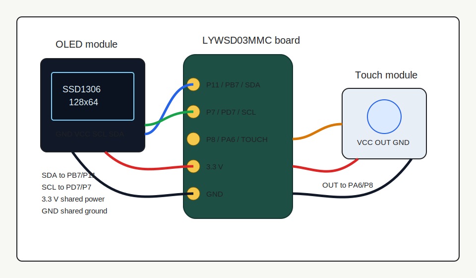

# Wiring Guide

This guide documents the wiring used by the included SSD1306 touch UI firmware builds.

## Pin Map

| Function | Firmware pin | Common board label | External module pin |
| --- | --- | --- | --- |
| OLED I2C data | PB7 | P11 | SDA |
| OLED I2C clock | PD7 | P7 | SCL |
| Touch input | PA6 | P8 | OUT |
| Ground | GND | GND | GND |
| Power | 3.3 V | 3V3 or external regulated 3.3 V | VCC |

## OLED Notes

- The firmware expects a 128x64 SSD1306 OLED on I2C address `0x3C`.
- Use `ATC_SSD1306_lopaka_touch_ui_v58.bin` for the normal wiring above.
- If the OLED stays dark, first verify power, ground, SDA, and SCL. Then try the rescue builds in `firmware/rescue`.
- Keep SDA and SCL short. If the OLED module already has pull-up resistors, they must pull to 3.3 V, not 5 V.

## Touch Sensor Notes

- The normal build expects an active-high touch output: idle low, touched high.
- The active-low build expects idle high, touched low.
- Touch module output goes to PA6/P8.
- Power the touch sensor from 3.3 V so the output level is safe for the Telink MCU.

## Power Notes

The OLED can use more current than the original segmented LCD. A coin cell may work poorly or only for testing. If using an external power supply:

- Use regulated 3.3 V.
- Share ground between the OLED, touch module, and thermometer board.
- Avoid powering the OLED at 5 V.
- Avoid leaving the OLED powered while the thermometer board is unpowered, because SDA/SCL can back-power the MCU through protection paths.

## Soldering Checklist

1. Remove the original LCD only if you are committed to the OLED conversion.
2. Tin the target pads lightly.
3. Solder GND first, then power, then SDA/SCL, then touch OUT.
4. Inspect for bridges under magnification.
5. Power the board from a current-limited supply for the first test.
6. Flash the main firmware and check that the OLED initializes.
